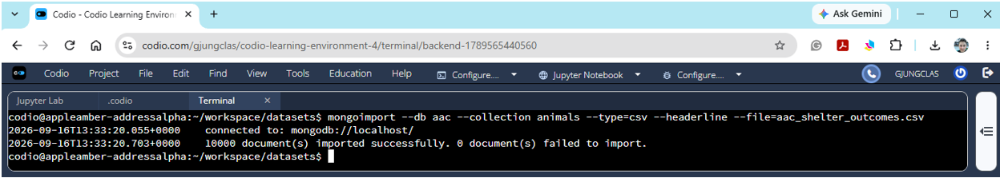
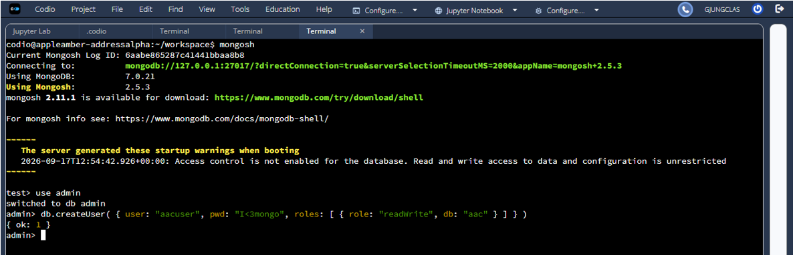
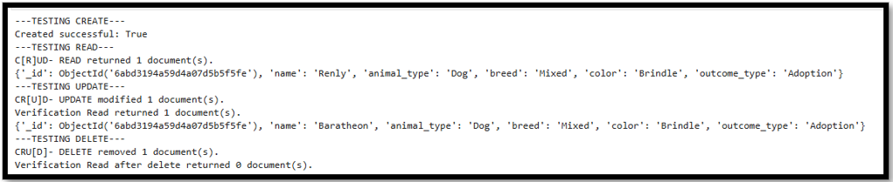

# CS 340 Project One: Grazioso Salvare CRUD Python Module Documentation

## About the Project: CRUD Python Module
This project provides a robust, reusable Python module offering complete Create, Read, Update, and Delete (CRUD) data access functionality for the Austin Animal Center (AAC) dataset stored within MongoDB. Developed for Grazioso Salvare, this module builds a secure, modular interface that abstracts low-level database operations from client consumer applications (such as Jupyter Notebook, automated testing scripts, or future dashboards). 

By encapsulating query construction, payload validation, and driver-level exception handling within an object-oriented `AnimalShelter` class, the module establishes clear separation of concerns, improves maintainability, and protects database integrity.

### Motivation
Modern interactive applications and analytical dashboards require reliable, secure data access layers. Formulating raw database queries directly within user interface scripts leads to tight coupling, redundant code, and heightened security risks. Implementing a centralized CRUD module decouples database logic from the presentation layer, allowing developers to query, modify, add, and remove records using standard Python data types (dictionaries and lists) without managing raw socket connections or manual error handling.

---

## Tooling & Driver Rationale

The module relies on the following core technologies:

| Tool | Rationale | Installation / Environment |
| :--- | :--- | :--- |
| **MongoDB (v7.0+)** | Chosen as the NoSQL document store for its flexible, schema-free BSON structure. Its dynamic document architecture accommodates real-world animal welfare records where attributes (e.g., outcome subtypes, embedded medical notes) vary across species. | Linux Package Management: `sudo apt update && sudo apt install -y mongodb-org mongodb-org-tools` |
| **PyMongo Driver** | The official Python client library for MongoDB. It was selected because it provides thread-safe connection pooling, native BSON serialization/deserialization, and seamless integration between native Python dictionaries and MongoDB collections. | Terminal via pip: `pip install pymongo` |
| **Python 3.x** | Provides clean syntax, native support for object-oriented programming (OOP), type hinting, and robust standard testing libraries like `unittest`. | Linux Package Management: `sudo apt install -y python3 python3-pip` |
| **Jupyter Notebook** | An interactive compute workbench utilized for rapid functional testing, output inspection, and exploratory data validation. | Terminal via pip: `pip install notebook` |
| **Codio Cloud IDE** | Standardized cloud Linux environment providing containerized host bindings, network isolation, and managed services. | Cloud-hosted platform |

---

## Database & User Authentication Setup

To replicate and configure this project from scratch:

### 1. Data Import
In the Linux terminal, navigate to the dataset directory and import the shelter outcomes CSV data into MongoDB using `mongoimport`:
```bash
mongoimport --type=csv --headerline --db aac --collection animals --drop ./aac_shelter_outcomes.csv
```


---

### 2. User Authentication Setup: 
Launch mongosh, switch to the admin database, and configure an authenticated user account (`aacuser`) with read and write permissions scoped specifically to the aac database:
```bash
use admin
```
```bash
db.createUser({
  user: "aacuser", 
  pwd: "<YourSecurePassword>", 
  roles: [ { role: "readWrite", db: "aac" } ] 
})
```
Verify Authentication within the shell: (after clearing the console or opening a new console)
```bash
use aac
```
```bash
db.auth("aacuser", "<YourSecurePassword>")
```



---

### 3. Module Connection Initialization: 
Update the connection string within the ```__init__``` constructor of ```AnimalShelter``` in ```CRUD_Python_Module.py``` with your assigned password to authenticate URI connectivity. Verify the string represents your username and password created in previous steps: 
```python
class AnimalShelter(object): 
    """ CRUD operations for Animal collection in MongoDB """ 

    def __init__(self): 
        # Initializing the MongoClient. This helps to access the MongoDB 
        # databases and collections. This is hard-wired to use the aac 
        # database, the animals collection, and the aac user. 
        # 
        # You must edit the password below for your environment. 
        # 
        # Connection Variables 
        # 
        USER = 'aacuser' 
        PASS = 'I<3mongo' 
        HOST = 'localhost' 
        PORT = 27017 
        DB = 'aac' 
        COL = 'animals' 
        # 
        # Initialize Connection 
        # 
        self.client = MongoClient('mongodb://%s:%s@%s:%d' % (USER, PASS, HOST, PORT)) 
        self.database = self.client['%s' % (DB)] 
        self.collection = self.database['%s' % (COL)] 
```

## Implementation Details & Working Functionality:
### Method Specifications (create, read, update, delete)
The AnimalShelter class encapsulates the full CRUD lifecycle using defensive programming practices and PEP8 conventions:
-	```create(data: dict) -> bool```:
    -	Functionality: Inserts a single record into the ```animals``` collection using ```collection.insert_one()```.
    -	Defensive Guard Clauses: Verifies that ```data``` is a non-empty dictionary. Returns ```True``` if acknowledged by MongoDB, or ```False``` if validation fails or an exception occurs (e.g., duplicate ```_id```).
-	```read(query: dict) -> list```:
    -	Functionality: Queries the collection using ```collection.find(query)``` and exhaustively unrolls the PyMongo cursor into a native Python list.
    -	Defensive Guard Clauses: Validates that ```query``` is a dictionary (accepting ```{}``` to perform wildcard searches across all records). Returns an empty list ```[]``` on invalid inputs or database read failures.
-	```update(query: dict, update_data: dict) -> int```:
    -	Functionality: Modifies matching records using ```collection.update_many()```.
    -	Defensive Guard Clauses & Operator Support: Ensures both arguments are valid dictionaries and that ```update_data``` is non-empty. Inspects payload keys; if raw fields are passed without atomic MongoDB operators (e.g., ```{"name": "Baratheon"}```), the method automatically encapsulates them in ```{"$set": update_data}```. Returns ```modified_count``` on success, or ```0``` on invalid input or failure.
-	```delete(query: dict) -> int```:
    -	Functionality: Removes matching records using ```collection.find(query)```.
    -	Defensive Guard Clauses: Requires that ```query``` is a non-empty dictionary. Passing an empty dictionary ```{}``` returns ```0``` immediately, preventing catastrophic, unauthorized collection-wide deletions. Returns ```deleted_count``` on success, or ```0``` on failure.

---

### Key Challenges & Overcome Solutions
1.	Handling PyMongo Cursor Objects: In early iterations, querying records with ```find()``` returned an unexhausted PyMongo cursor rather than a native list. Attempting to evaluate document length or index records directly caused runtime errors. This was resolved by explicitly unrolling the cursor using ```list(cursor)``` before returning results from the read method.
2.	Silent Exception Handling & Return Types: Primary key collisions (MongoDB error code ```11000```) and malformed queries previously risked terminating runtime scripts. Wrapping operations in ```try/except Exception as e:``` blocks ensures exceptions are logged to stdout while returning clean, typed fallback values (```False```, ```[]```, or ```0```) to calling services.
3.	Data Loss Prevention in Deletion: In MongoDB, ```delete_many({})``` wipes an entire collection. Adding the guard clause ```if isinstance(query, dict) and query:``` explicitly prevents accidental full collection purges.

## Functional Operations & Demonstration
The operational capabilities of the AnimalShelter CRUD module were validated inside a Jupyter Notebook environment using two distinct testing tiers: the baseline required sequential end-to-end integration test script, followed by an expanded automated unit testing suite. 

### End-to-End Functional Test Script (ProjectOneTestScript.ipynb)
To satisfy the project requirements, a sequential demonstration script was developed and executed against the live Austin Animal Center MongoDB collection. This script authenticates as aacuser, initializes an instance of AnimalShelter, and systematically drives an individual animal record through its full database lifecycle: insertion (Create), query verification (Read), attribute modification (Update), and document removal (Delete).

---

#### Code Execution
To execute this functional demonstration, the following sequential operations are carried out:
1.	Import and Initialization
The AnimalShelter class is imported from the custom module and instantiated to establish authenticated connectivity to the aac database and animals collection:
```python
# import CRUD module
from CRUD_Python_Module import AnimalShelter
# Instantiate an instance of the class
shelter = AnimalShelter()
```
3.	Create Operation 
A sample animal record representing a mixed-breed dog named “Renly” is structured as a Python dictionary and submitted to the create() method. The method returns True, verifying database acknowledgement:
```python
test_animal = {
    "name": "Renly",
    "animal_type": "Dog",
    "breed": "Mixed",
    "color": "Brindle",
    "outcome_type": "Adoption"
}

create_success = shelter.create(test_animal)
print(f"Created successful: {create_success}")
```
4.	Read Operation
The database is queried using the lookup criteria {“name”: “Renly”}. The read() method exhausts the PyMongo cursor into a native Python list, confirming persistence in MongoDB and returning its generated _id alongside all record fields:
```python
query_read = {"name": "Renly"}
read_results = shelter.read(query_read)

print(f"C[R]UD- READ returned {len(read_results)} document(s).")
for doc in read_results:
    print(doc)
```
5.	Update Operation 
The record is targeted by its original name attribute and modified, changing the animal’s name to “Baratheon”. The update() method wraps raw dictionary updates into MongoDB’s atomic $set operator, executes update_many(), and returns a modified count of 1. An immediate follow-up read operations verifies that the document’s name updated under the exact same _id:
```python
update_filter = {"name": "Renly"}
update_data = {"name": "Baratheon"}

modified_count = shelter.update(update_filter, update_data)
print(f"CR[U]D- UPDATE modified {modified_count} document(s).")

# Verify record update via read
updated_records = shelter.read({"name": "Baratheon"})
print(f"Verification Read returned {len(updated_records)} document(s).")
for doc in updated_records:
    print(doc)
```
7.	Delete Operation 
The modified record is targeted using the filter {“name”: “Baratheon”} and removed via delete(). The method executes delete_many() after validating that the query dictionary is non-empty, successfully returning a deleted count of 1. A subsequent verification read confirms that 0 matching records remain, proving successful removal:
```python
delete_filter = {"name": "Baratheon"}

deleted_count = shelter.delete(delete_filter)
print(f"CRU[D]- DELETE removed {deleted_count} document(s).")

# Verify deletion via read (should return 0 documents) 
post_delete_records = shelter.read(delete_filter)
print(f"Verification Read after delete returned {len(post_delete_records)} document(s).")
```

---

#### Execution Output Trace
Executing the script produced the following output trace, verifying the successful sequential execution of all four CRUD operations:


## Extended Verification: Automated unittest Suite
### Test Matrix Summary
### Test Suite Code
### Test Execution Results

## Future Roadmap

## Contact
