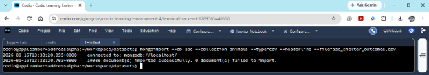
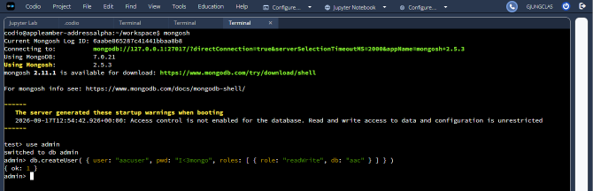

# CS 340 Project One: Grazioso Salvare CRUD Python Module Documentation

## About the Project: CRUD Python Module
This project provides a robust, reusable Python module offering complete Create, Read, Update, and Delete (CRUD) data access functionality for the Austin Animal Center (AAC) dataset stored within MongoDB. Developed for Grazioso Salvare, this module builds a secure, modular interface that abstracts low-level database operations from client consumer applications (such as Jupyter Notebook, automated testing scripts, or future dashboards). 

By encapsulating query construction, payload validation, and driver-level exception handling within an object-oriented `AnimalShelter` class, the module establishes clear separation of concerns, improves maintainability, and protects database integrity.

### Motivation
Modern interactive applications and analytical dashboards require reliable, secure data access layers. Formulating raw database queries directly within user interface scripts leads to tight coupling, redundant code, and heightened security risks. Implementing a centralized CRUD module decouples database logic from the presentation layer, allowing developers to query, modify, add, and remove records using standard Python data types (dictionaries and lists) without managing raw socket connections or manual error handling.

---

## Tooling & Driver Rationale

The module relies on the following core technologies:

| Tool | Rationale | Installation / Environment |
| :--- | :--- | :--- |
| **MongoDB (v7.0+)** | Chosen as the NoSQL document store for its flexible, schema-free BSON structure. Its dynamic document architecture accommodates real-world animal welfare records where attributes (e.g., outcome subtypes, embedded medical notes) vary across species. | Linux Package Management: `sudo apt update && sudo apt install -y mongodb-org mongodb-org-tools` |
| **PyMongo Driver** | The official Python client library for MongoDB. It was selected because it provides thread-safe connection pooling, native BSON serialization/deserialization, and seamless integration between native Python dictionaries and MongoDB collections. | Terminal via pip: `pip install pymongo` |
| **Python 3.x** | Provides clean syntax, native support for object-oriented programming (OOP), type hinting, and robust standard testing libraries like `unittest`. | Linux Package Management: `sudo apt install -y python3 python3-pip` |
| **Jupyter Notebook** | An interactive compute workbench utilized for rapid functional testing, output inspection, and exploratory data validation. | Terminal via pip: `pip install notebook` |
| **Codio Cloud IDE** | Standardized cloud Linux environment providing containerized host bindings, network isolation, and managed services. | Cloud-hosted platform |

---

## Database & User Authentication Setup

To replicate and configure this project from scratch:

### 1. Data Import
In the Linux terminal, navigate to the dataset directory and import the shelter outcomes CSV data into MongoDB using `mongoimport`:
```bash
mongoimport --type=csv --headerline --db aac --collection animals --drop ./aac_shelter_outcomes.csv
```


### 2. User Authentication Setup: 
Launch mongosh, switch to the admin database, and configure an authenticated user account (`aacuser`) with read and write permissions scoped specifically to the aac database:
```bash
use admin
```
```bash
db.createUser({
  user: "aacuser", 
  pwd: "<YourSecurePassword>", 
  roles: [ { role: "readWrite", db: "aac" } ] 
})
```
Verify Authentication within the shell:
```bash
use aac
```
```bash
db.auth("aacuser", "<YourSecurePassword>")
```




